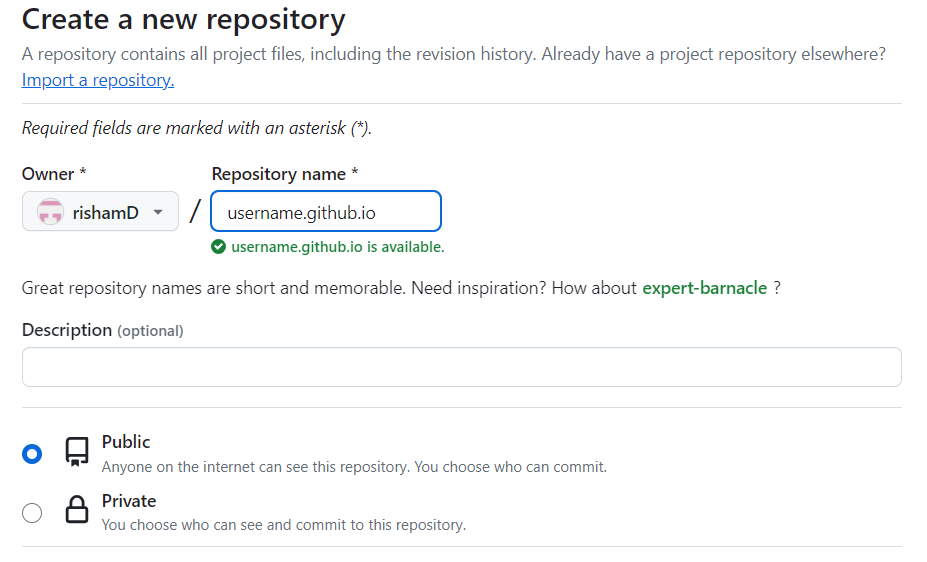

# README: Hosting Your Resume on GitHub Pages

Hello! In this README, I'll guide you through the process of hosting your resume on GitHub Pages. My aim is not only to provide technical steps but ensuring clarity, simplicity, and a user-centric approach in the documentation.
- My Resume that is hosted on Github Pages [MyResume](https://rishamd.github.io).
- You can check this repository at [Github](https://github.com/rishamD/rishamD.github.io).
- You can follow the given steps to host your own resume.

## Step-by-Step Guide:

### 1. Create a GitHub Account (if you haven't already):

If you don't have a GitHub account, visit [GitHub](https://github.com/) and sign up for a free account. Online documentation ensures accessibility and searchability, facilitating easy access to information and efficient navigation through search functionality. Additionally, it enables version control allowing for easy updates. This is easily acheived by Github. 

### 2. Create a New Repository:

- Click on the "+" sign in the top right corner of your GitHub account and select "New repository."
 
- Name your repository `yourusername.github.io`, replacing `yourusername` with your actual GitHub username.
  
- Optionally, add a description and choose whether to make it public or private (I recommend making it public so can use Github pages for free).

### 3. Prepare Your Resume:

Before proceeding, ensure your resume is in Markdown format. If it's in another format (e.g., Microsoft Word or PDF), you'll need to convert it to Markdown. You can use online converters or Markdown editors of your choice. We use lightweight markdown due to its simplicity and readability, enabling writers to focus on content creation without being bogged down by complex formatting, while also ensuring compatibility across various platforms and easy version control integration.
Rename it to "index.md" so it can be hosted on your username.github.io page.

### 4. Upload Your Resume:

- Once your repository is created, navigate to it.
- Click on the "Add file" button and select "Upload files."
- Upload your Markdown resume file to the repository.
  
  

### 5. Enable GitHub Pages:

- Go to the "Settings" tab of your repository.
- In order to enable pages you need to make your repository public or buy Github premium.
- Select "main" or "master" branch (depending on your default branch).
- Click "Save."
  
### 6. Access Your Hosted Resume:

- After saving, scroll back down to the "GitHub Pages" section to find the link to your hosted resume.
- It should be something like `https://yourusername.github.io`.

Congratulations! Your resume is now hosted on GitHub Pages and accessible to anyone with the provided link.
You can also add themes to your hosted file using jekyll by making a file called "_config.yml" and add the following code to use the "Hacker" theme  
`remote_theme: pages-themes/hacker@v0.2.0`    
`plugins:`    
`- jekyll-remote-theme`  

My resume looks like the following.   

  

## Authors and Acknowledgements
I would like to thank [DomPizzie](https://gist.github.com/DomPizzie) for the readme template and would like to acknowledge my group members for their help.

## FAQs
- Question - Why is Markdown better than a word processor?   Answer - Because Markdown is better for websites and it is free unlike Word's abysmal HTML exports.
  
- Question - Why did my Jekyll theme not apply?   Answer - One reason maybe the code has a typo(in _config.yml) or the website is still building (I had another problem where i had spaces after my code in _config.yml, removing them fixed the theme for me).
 
## Additional Resources
- Guide [ReadMeGuide](https://www.makeareadme.com/).
- Hacker [Theme](https://github.com/pages-themes/hacker).
- Template [DomPizzie](https://gist.github.com/DomPizzie)
- More [Jekyll Themes](https://jekyllrb.com/docs/themes/)
